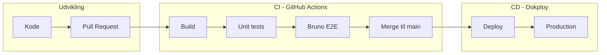

# CI vs CD

CI og CD er to forskellige faser i softwareleveringen. I vores setup håndteres de af **to forskellige værktøjer**.

## Continuous Integration (CI)

CI handler om at teste og validere koden **før** den rammer en vigtig branch (`main`, `staging`).

CI sørger for:

- Bygger projektet
- Kører unit- og integrationstests
- Checker PRs
- Stopper dårlig kode **tidligt**
- Giver udvikleren feedback i GitHub

::: info
CI = *"Er koden god nok til at komme i main?"*
:::

## Continuous Deployment (CD)

CD handler om *hvad der sker efter* koden er godkendt — altså efter CI.

Typisk:

- Bygge Docker-image
- Deploye til staging/production
- Starte containere og services

I vores opsætning håndteres CD af **Dokploy**, ikke GitHub.

::: info
CD = *"Deploy den nye version — når den er testet og klar."*
:::

## Hvor passer tests ind?

**1. CI (GitHub Actions)** — kør tests FØR merge:

- Build
- Unit tests
- Integration tests (valgfrit)
- Bruno E2E via docker-compose test-miljø

**Kun hvis CI er grønt → må koden merges til `main`.**

**2. CD (Dokploy)** — efter merge:

- Deploy til server
- Opdater containers
- Rollback hvis noget går galt

## GA vs Dokploy

| Funktion | GitHub Actions (CI) | Dokploy (CD) |
|----------|---------------------|--------------|
| Tester ved PR | Ja | Nej |
| Stopper merge ved fejl | Ja | Nej |
| Tester i miljø | Ja (med docker-compose) | Ja (produktion) |
| Deploy | Nej | Ja |

**GitHub Actions = kvalitetssikring før merge.**

**Dokploy = deployment efter merge.**

## Hele billedet

| Fase | Værktøj | Tests |
|------|---------|-------|
| Lokal udvikling | Visual Studio, `dotnet test`, Bruno GUI | Manuelt + automatisk |
| Pull request | GitHub Actions | Unit + E2E i container |
| Production | Dokploy | Smoke/E2E kan køres ved deploy |
