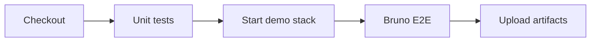

# GitHub Actions

GitHub Actions er vores CI-værktøj — det tester og validerer koden **før** den rammer `main`.

## Eksempel: .NET + Bruno pipeline

```yaml
name: CI Pipeline

on:
  pull_request:
  push:
    branches: ["main"]

jobs:
  unit-tests:
    name: Unit tests
    runs-on: ubuntu-latest
    steps:
      - uses: actions/checkout@v4

      - name: Setup .NET
        uses: actions/setup-dotnet@v4
        with:
          dotnet-version: '10.0.x'

      - name: Restore
        run: dotnet restore Backend/Tests/Tests.csproj

      - name: Build
        run: dotnet build Backend/Tests/Tests.csproj --no-restore -c Release

      - name: Test
        run: dotnet test Backend/Tests/Tests.csproj --no-build -c Release --verbosity normal

  api-tests:
    name: Bruno API tests (demo container)
    runs-on: ubuntu-latest
    needs: unit-tests
    steps:
      - uses: actions/checkout@v4

      - name: Start demo stack
        run: |
          docker compose -f docker-compose.test.yml up -d
          for i in $(seq 1 30); do
            if curl -sf http://localhost:9080/swagger/v1/swagger.json > /dev/null; then
              break
            fi
            sleep 2
          done

      - name: Setup Node.js
        uses: actions/setup-node@v4
        with:
          node-version: '22'

      - name: Install Bruno CLI
        run: npm install -g @usebruno/cli

      - name: Run Bruno E2E
        working-directory: Bruno
        run: |
          bru run E2E-UserFlows -r --env Kahoot \
            --env-var "baseUrl=http://localhost:9080" \
            --reporter-junit bruno-results.xml

      - name: Upload Bruno results
        if: always()
        uses: actions/upload-artifact@v4
        with:
          name: bruno-junit
          path: Bruno/bruno-results.xml

      - name: Stop demo stack
        if: always()
        run: docker compose -f docker-compose.test.yml down -v
```

## Hvad sker der?



| Step | Formål |
|------|--------|
| **unit-tests** | `dotnet test` — hurtig feedback på PR-koden |
| **api-tests** | Starter PostgreSQL + backend i Docker, kører Bruno mod localhost |
| **artifacts** | JUnit-rapport gemmes — nyttig ved fejl |
| **always()** | Demo-stack stoppes selvom tests fejler |

## Essensen af CI

- Koden skal **bygge**
- Tests skal være **grønne**
- E2E køres i et midlertidigt docker-compose setup
- Pipeline **stopper** hvis noget fejler — ingen dårlig kode ind på `main`

## Fejlsøgning

| Problem | Hvor kigger du? |
|---------|----------------|
| Unit test fejler | GitHub Actions log for `unit-tests` job |
| Bruno fejler | `api-tests` log + `bruno-junit` artifact |
| Backend starter ikke | `docker compose logs backend` i workflow (tilføj ved failure) |

::: tip Integration tests i CI
Du kan udvide pipelinen med `dotnet test Backend/IntegrationTests/` som et separat job mellem unit og Bruno.
:::
