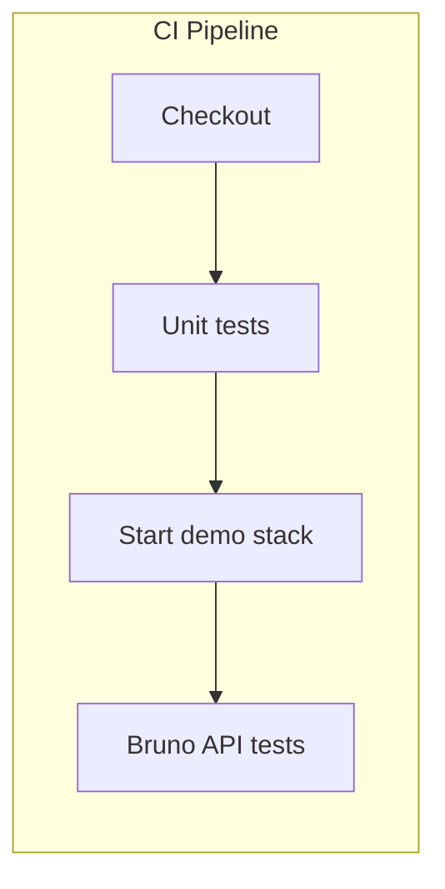
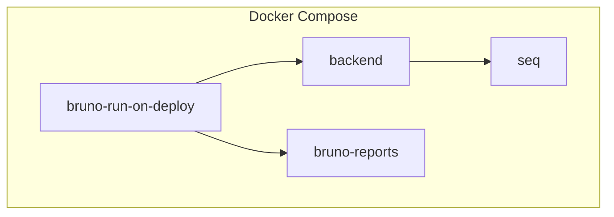

# Docker og CI

E2E-tests kan køres lokalt, i Docker Compose og i GitHub Actions. I h4-mags kører CI Bruno mod en **demo-container** — ikke kun mod deployed API.

## CI pipeline (aktuel opsætning)

Ved push eller pull request til `main` kører to jobs i rækkefølge:



| Job | Hvad sker der? |
|-----|----------------|
| **unit-tests** | `dotnet test Backend/Tests/` |
| **api-tests** | Starter `docker-compose.test.yml`, venter på backend, kører `bru run E2E-UserFlows` mod `http://localhost:9080` |

Den aktuelle [ci.yml](https://github.com/Mercantech/H4-MAGS/blob/main/.github/workflows/ci.yml):

```yaml
api-tests:
  name: Bruno API tests (demo container)
  runs-on: ubuntu-latest
  needs: unit-tests
  steps:
    - uses: actions/checkout@v4

    - name: Start demo stack (PostgreSQL + Backend)
      run: |
        docker compose -f docker-compose.test.yml up -d
        # Vent på at backend svarer på http://localhost:9080

    - name: Install Bruno CLI
      run: npm install -g @usebruno/cli

    - name: Run Bruno collection mod demo-API
      working-directory: Bruno
      run: |
        bru run E2E-UserFlows -r --env Kahoot \
          --env-var "baseUrl=http://localhost:9080" \
          --reporter-junit bruno-results.xml

    - name: Stop demo stack
      if: always()
      run: docker compose -f docker-compose.test.yml down -v
```

::: tip Forbedring ift. ældre opsætning
Tidligere kørte Bruno mod den **deployed** API på PR — så E2E testede ikke PR-koden. Med demo-container i CI tester E2E den **faktiske kode** i branchen.
:::

## Docker Compose lokalt

Compose bruges til at køre backend, Bruno og rapporter:



| Service | Rolle |
|---------|-------|
| **backend** | API (port 9080) |
| **seq** | Logging |
| **bruno-run-on-deploy** | Kører `bru run` én gang ved deploy, skriver HTML-rapport |
| **bruno-reports** | Servicer rapporten (fx port 9083) |

## Lokal udvikling

```bash
# Start backend + DB
docker compose up -d backend

# Kør Bruno mod localhost
cd Bruno
bru run E2E-UserFlows -r --env Kahoot --env-var "baseUrl=http://localhost:9080"
```

## Sammenfatning

| Du har lært | Nu bruger vi også |
|-------------|-------------------|
| **Unit test** — én metode med mocks | **E2E** — hele brugerrejser som HTTP |
| Tests i C# (NUnit, Moq) | Tests i Bruno (HTTP + scripts) |
| Kør `dotnet test` | Kør `bru run E2E-UserFlows` |

**CI:** Push/PR → unit tests → demo-container → Bruno E2E mod localhost.

**Docker:** Backend + kør E2E og vis rapport.

Flows 01 → 02 → 03 deler variabler (`createdUserId`, `authToken`, `sessionId`) — det er det, der gør det til én lang E2E-rejse.
