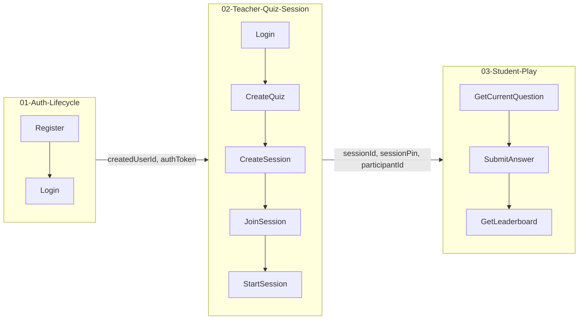
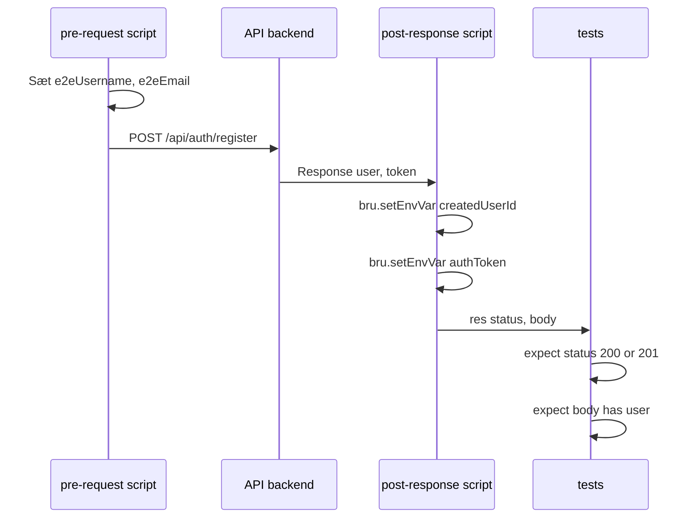

# Flows og variabler

Alle E2E-flows i h4-mags ligger under **`Bruno/E2E-UserFlows/`**. Flowene afhænger af hinanden og deler state via **miljøvariabler**.

## Overblik



## State mellem requests

| Flow | Sætter variabler | Bruger variabler |
|------|------------------|------------------|
| **01 Auth** | `createdUserId`, `authToken`, `refreshToken` | — |
| **02 Teacher** | `sessionId`, `sessionPin`, `createdQuizId` | `authToken`, `createdUserId` |
| **03 Student** | — | `sessionId`, `sessionPin`, `participantId` |

Variabler defineres i **`Bruno/environments/Kahoot.bru`** og sættes/læses i request-scripts.

## Én request i detaljer



### pre-request script (eksempel)

```javascript
const id = Date.now();
bru.setEnvVar("e2eUsername", `e2e_user_${id}`);
bru.setEnvVar("e2eEmail", `e2e_${id}@test.com`);
```

### post-response script (eksempel)

```javascript
const body = res.getBody();
bru.setEnvVar("createdUserId", body.user.id);
bru.setEnvVar("authToken", body.token);
```

### tests (eksempel)

```javascript
test("status is 200 or 201", function() {
  expect(res.getStatus()).to.be.oneOf([200, 201]);
});
test("body has user and token", function() {
  const body = res.getBody();
  expect(body).to.have.property("user");
  expect(body).to.have.property("token");
});
```

## Det samme mønster overalt

I **CreateQuiz** bruger vi `createdUserId` fra Register/Login og sætter `createdQuizId` i post-response — så CreateSession kan bruge den. State deles via variabler mellem requests. Det er det, der gør det til **E2E**: én lang rejse gennem systemet.
