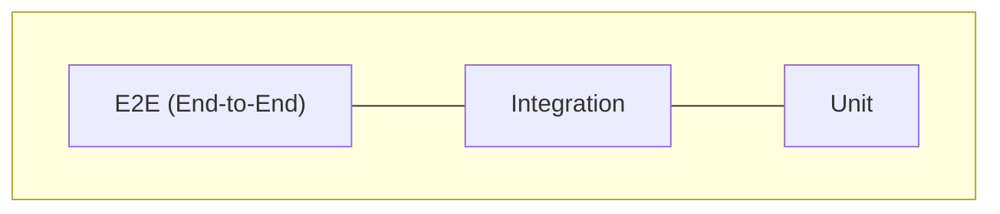

# E2E testing

E2E (End-to-End) tests verificerer at **hele brugerrejsen** fungerer — som en rigtig bruger ville opleve den, via HTTP-requests mod API'et.

<LearningGoals
  section="e2e-testing"
  :goals="[
    'Jeg kan opbygge og strukturere en API-testkollektion i Bruno',
    'Jeg kan skrive automatiske E2E-tests der validerer API-responser, auth, fejlscenarier og edge cases',
    'Jeg kan eksportere og dele en test-suite til brug i pipeline'
  ]"
/>

## Emner i dette afsnit

| Side | Indhold |
|------|---------|
| [Bruno og API-tests](/e2e-testing/bruno) | Hvorfor Bruno, vs. Postman |
| [Flows og variabler](/e2e-testing/flows-og-variabler) | E2E-struktur i h4-mags |
| [Docker og CI](/e2e-testing/docker-og-ci) | Kør E2E i pipeline og lokalt |

## Fra unit til E2E

| Lag | Hvad tester vi? | Hvor i h4-mags? |
|-----|-----------------|-----------------|
| **Unit** | Én klasse/metode i isolation (mocks) | `Backend/Tests/` — NUnit + Moq |
| **Integration** | API + database sammen | `WebApplicationFactory` + test-DB |
| **E2E** | Hele brugerrejsen mod API | `Bruno/E2E-UserFlows/` |

**API-testing** = HTTP-requests (GET, POST, ...) + tjek af statuskode og response-body.

**E2E** = en **hel brugerrejse** som sekvens af requests (registrer → login → opret quiz → ...).

Eksempler fra [h4-mags](https://github.com/Mercantech/h4-mags).

::: tip Næste emne
Når E2E-tests skal køres automatisk ved hver push, går du videre til [CI og CD](/ci-cd/).
:::
