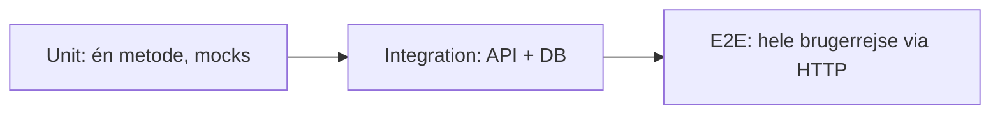

# Integration testing

Integration tests verificerer at **flere dele virker sammen** — typisk API + database — uden at mocke de interne lag.

<LearningGoals
  section="integration-testing"
  :goals="[
    'Jeg kan forklare forskellen mellem unit test (mocks) og integration test (rigtige dependencies)',
    'Jeg kan skrive integration tests med WebApplicationFactory der tester API-endpoints mod en test-database',
    'Jeg forstår hvornår integration tests giver mening — og hvornår de supplerer unit tests'
  ]"
/>

## Emner i dette afsnit

| Side | Indhold |
|------|---------|
| [Hvad er det?](/integration-testing/hvad-er-det) | Mellem unit og E2E — hvad tester vi? |
| [WebApplicationFactory](/integration-testing/web-application-factory) | Start hele API'et in-process |
| [Test-database](/integration-testing/test-database) | InMemory vs. rigtig test-DB |
| [Opgave](/integration-testing/opgave) | Skriv API + DB tests |

## Bro fra unit til E2E

- **Unit:** Du testede `AuthService.HashPassword()` med mocks
- **Integration:** Du tester `POST /api/auth/register` og verificerer at brugeren gemmes i DB
- **E2E:** Du tester registrer → login → opret quiz som en lang Bruno-flow

::: tip Næste emne
Når hele brugerrejsen skal testes på tværs af systemer, går du videre til [E2E testing](/e2e-testing/) med Bruno.
:::
