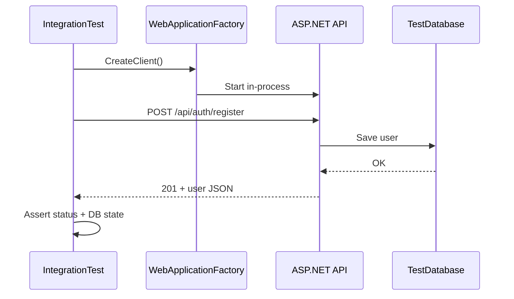

# WebApplicationFactory

`WebApplicationFactory<T>` er .NET's standardmåde at køre hele ASP.NET-appen **in-process** til integration tests.

## Konceptet

I stedet for at starte API'et manuelt og sende requests med `HttpClient` mod `localhost`, opretter factory'en en test-server:

```csharp
public class AuthIntegrationTests : IClassFixture<WebApplicationFactory<Program>>
{
    private readonly HttpClient _client;

    public AuthIntegrationTests(WebApplicationFactory<Program> factory)
    {
        _client = factory.CreateClient();
    }

    [Fact]
    public async Task Register_ValidUser_Returns201()
    {
        // Arrange
        var payload = new
        {
            username = "testuser",
            email = "test@example.com",
            password = "TestPassword123!"
        };

        // Act
        var response = await _client.PostAsJsonAsync("/api/auth/register", payload);

        // Assert
        Assert.That(response.StatusCode, Is.EqualTo(HttpStatusCode.Created));
        var body = await response.Content.ReadFromJsonAsync<RegisterResponse>();
        Assert.That(body?.Token, Is.Not.Null);
    }
}
```

## Flowet



## Tilpas test-miljøet

Ofte skal du override konfiguration til test:

```csharp
var factory = new WebApplicationFactory<Program>()
    .WithWebHostBuilder(builder =>
    {
        builder.ConfigureServices(services =>
        {
            var descriptor = services.SingleOrDefault(
                d => d.ServiceType == typeof(DbContextOptions<ApplicationDbContext>));
            if (descriptor != null) services.Remove(descriptor);

            services.AddDbContext<ApplicationDbContext>(options =>
                options.UseInMemoryDatabase("TestDb"));
        });
    });
```

## Hvad testes?

- Routing og controller-attributter
- Middleware (auth, exception handling)
- Model binding og validering
- Service → repository → database
- HTTP statuskoder og response-format

## Projektstruktur

```
Backend/
  API/
  Tests/                    ← unit tests (eksisterer)
  IntegrationTests/         ← nyt projekt
    AuthIntegrationTests.cs
    QuizIntegrationTests.cs
```

Kør med:

```bash
dotnet test Backend/IntegrationTests/
```
