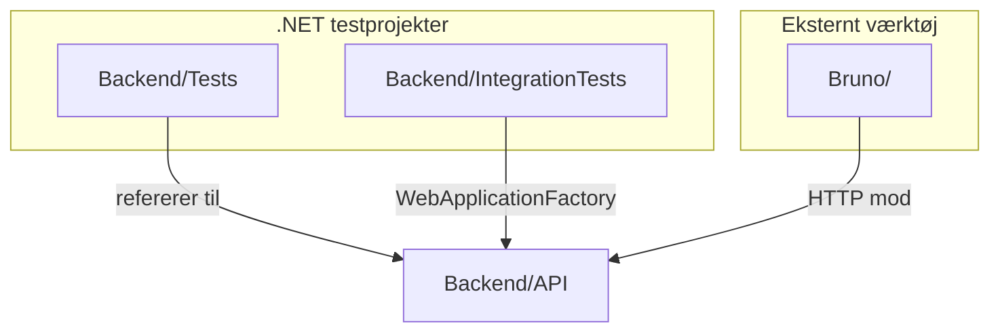
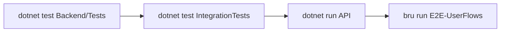

# Kom i gang

Denne side forklarer **hvilke testprojekter du skal have i .NET**, hvordan de hænger sammen — og præcis hvordan du kommer i gang med at køre og skrive tests.

Vi bruger [h4-mags](https://github.com/Mercantech/H4-MAGS) som referenceprojekt: en Kahoot-lignende app med C# API, Flutter-frontend og Bruno E2E-tests.

## Overblik: tre slags testprojekter

| Type | .NET-projekt? | Hvad tester det? | Eksempel i h4-mags |
|------|---------------|------------------|-------------------|
| **Unit** | Ja — `Tests.csproj` | Én klasse/metode med mocks | `Backend/Tests/` |
| **Integration** | Ja — `IntegrationTests.csproj` | API + database sammen | Oprettes af jer (se nedenfor) |
| **E2E** | Nej — Bruno (`.bru`-filer) | Hele brugerrejser via HTTP | `Bruno/E2E-UserFlows/` |



::: tip Rækkefølge
Start med **unit tests** → tilføj **integration tests** → kør **Bruno E2E** mod API'et. Teori til hvert trin findes i de øvrige emner.
:::

---

## Forudsætninger

Du skal have installeret:

- [.NET SDK](https://dotnet.microsoft.com/download) (10.x — som h4-mags)
- [Visual Studio 2022](https://visualstudio.microsoft.com/) eller Rider (anbefalet til Test Explorer)
- [Git](https://git-scm.com/)

Valgfrit til E2E:

- [Bruno](https://www.usebruno.com/) (GUI)
- Node.js + `@usebruno/cli` (kommandolinje / CI)

### Klon referenceprojektet

```bash
git clone https://github.com/Mercantech/H4-MAGS.git
cd H4-MAGS
```

---

## Projektstruktur i h4-mags

```
H4-MAGS/
├── Backend/
│   ├── API/                 ← ASP.NET Web API (det I tester)
│   └── Tests/               ← Unit tests (findes allerede)
│       ├── Tests.csproj
│       ├── AuthServiceTests.cs
│       ├── JwtServiceTests.cs
│       ├── UserModelTests.cs
│       └── QuizControllerHelperTests.cs
├── Bruno/                   ← E2E API-tests (ikke C#)
│   ├── E2E-UserFlows/
│   ├── environments/
│   └── bruno.json
└── flutter_app/             ← Mobil-app (testes manuelt / senere)
```

---

## 1. Unit test-projekt

Unit tests kører i et **NUnit**-projekt der refererer til API'et. De tester én klasse ad gangen med mocks.

### Kør eksisterende tests i h4-mags

**Visual Studio:**

1. Åbn `Backend/Backend.slnx` (eller solution-filen)
2. Åbn **Test Explorer** (Test → Test Explorer)
3. Klik **Run All**

**Kommandolinje:**

```bash
cd Backend/Tests
dotnet test
```

Forventet output når alt er grønt:

```
Passed!  - Failed:     0, Passed:    XX, Skipped:     0, Total:    XX
```

### Opret unit test-projekt fra scratch

Hvis du starter et nyt projekt uden testmappe:

```bash
cd Backend
dotnet new nunit -n Tests
cd Tests
dotnet add reference ../API/API.csproj
dotnet add package NUnit
dotnet add package NUnit3TestAdapter
dotnet add package Microsoft.NET.Test.Sdk
dotnet add package Moq
dotnet add package Microsoft.EntityFrameworkCore.InMemory
```

**`Tests.csproj`** (minimum):

```xml
<Project Sdk="Microsoft.NET.Sdk">
  <PropertyGroup>
    <TargetFramework>net10.0</TargetFramework>
    <ImplicitUsings>enable</ImplicitUsings>
    <Nullable>enable</Nullable>
    <IsPackable>false</IsPackable>
  </PropertyGroup>

  <ItemGroup>
    <PackageReference Include="Microsoft.NET.Test.Sdk" Version="17.*" />
    <PackageReference Include="NUnit" Version="4.*" />
    <PackageReference Include="NUnit3TestAdapter" Version="4.*" />
    <PackageReference Include="Moq" Version="4.*" />
    <PackageReference Include="Microsoft.EntityFrameworkCore.InMemory" Version="10.*" />
  </ItemGroup>

  <ItemGroup>
    <ProjectReference Include="..\API\API.csproj" />
  </ItemGroup>
</Project>
```

### Din første unit test

Opret `MyFirstTests.cs`:

```csharp
namespace Tests;

[TestFixture]
public class MyFirstTests
{
    [Test]
    public void Add_TwoPlusTwo_ReturnsFour()
    {
        // Arrange
        var expected = 4;

        // Act
        var result = 2 + 2;

        // Assert
        Assert.That(result, Is.EqualTo(expected));
    }
}
```

Kør:

```bash
dotnet test
```

### Hvad tester h4-mags allerede?

| Testfil | Hvad den dækker |
|---------|-----------------|
| `AuthServiceTests.cs` | Password hash, registrering, login — med mocks |
| `JwtServiceTests.cs` | Token-generering og validering |
| `UserModelTests.cs` | Model properties og normalisering |
| `QuizControllerHelperTests.cs` | Pure helper-metoder |
| `UnitTest1.cs` | Simpelt AAA-eksempel |

Se [Unit testing](/unit-testing/) for AAA, mocking og opgaver.

---

## 2. Integration test-projekt

Integration tests er et **separat** .NET-projekt. De starter hele API'et in-process med `WebApplicationFactory` og bruger en test-database.

### Opret projektet

```bash
cd Backend
dotnet new nunit -n IntegrationTests
cd IntegrationTests
dotnet add reference ../API/API.csproj
dotnet add package NUnit
dotnet add package NUnit3TestAdapter
dotnet add package Microsoft.NET.Test.Sdk
dotnet add package Microsoft.AspNetCore.Mvc.Testing
dotnet add package Microsoft.EntityFrameworkCore.InMemory
```

**`IntegrationTests.csproj`:**

```xml
<Project Sdk="Microsoft.NET.Sdk">
  <PropertyGroup>
    <TargetFramework>net10.0</TargetFramework>
    <ImplicitUsings>enable</ImplicitUsings>
    <Nullable>enable</Nullable>
    <IsPackable>false</IsPackable>
  </PropertyGroup>

  <ItemGroup>
    <PackageReference Include="Microsoft.NET.Test.Sdk" Version="17.*" />
    <PackageReference Include="NUnit" Version="4.*" />
    <PackageReference Include="NUnit3TestAdapter" Version="4.*" />
    <PackageReference Include="Microsoft.AspNetCore.Mvc.Testing" Version="10.*" />
    <PackageReference Include="Microsoft.EntityFrameworkCore.InMemory" Version="10.*" />
  </ItemGroup>

  <ItemGroup>
    <ProjectReference Include="..\API\API.csproj" />
  </ItemGroup>
</Project>
```

::: warning Program-klasse
`WebApplicationFactory<Program>` kræver at API-projektet eksponerer `Program` til test. I .NET 6+ tilføjes typisk i `API.csproj`:

```xml
<PropertyGroup>
  <InternalsVisibleTo Include="IntegrationTests" />
</PropertyGroup>
```

Og i `Program.cs` (nederst):

```csharp
public partial class Program { }
```
:::

### Minimal integration test

```csharp
namespace IntegrationTests;

public class HealthIntegrationTests
{
    private readonly HttpClient _client;

    public HealthIntegrationTests()
    {
        var factory = new WebApplicationFactory<Program>();
        _client = factory.CreateClient();
    }

    [Test]
    public async Task Swagger_IsReachable()
    {
        var response = await _client.GetAsync("/swagger/v1/swagger.json");
        Assert.That(response.StatusCode, Is.EqualTo(HttpStatusCode.OK));
    }
}
```

Kør:

```bash
cd Backend/IntegrationTests
dotnet test
```

Se [Integration testing](/integration-testing/) for database-setup og opgaver.

---

## 3. E2E med Bruno (ikke et .NET-projekt)

E2E-tests i h4-mags er **ikke** C#-kode — de ligger som `.bru`-filer i `Bruno/` og sender rigtige HTTP-requests mod API'et.

### Mappestruktur

```
Bruno/
├── bruno.json              ← collection-root
├── collection.bru
├── environments/
│   └── Kahoot.bru          ← baseUrl, variabler
├── E2E-UserFlows/          ← hele brugerrejser (CI)
│   ├── 01-Auth-Lifecycle/
│   ├── 02-Teacher-Quiz-Session/
│   └── 03-Student-Play/
├── Auth/                   ← manuelle/enkeltstående tests
└── Quiz/
```

### Kom i gang med Bruno

1. **Start API'et lokalt:**

```bash
cd Backend/API
dotnet run
# eller: docker compose up -d backend
```

2. **Åbn collection i Bruno GUI:**

   - File → Open Collection → vælg `Bruno/`-mappen
   - Vælg miljø **Kahoot** og sæt `baseUrl` til `http://localhost:9080` (eller din port)

3. **Kør fra kommandolinjen:**

```bash
npm install -g @usebruno/cli
cd Bruno
bru run E2E-UserFlows -r --env Kahoot --env-var "baseUrl=http://localhost:9080"
```

Se [E2E testing](/e2e-testing/) for flows, variabler og CI.

---

## Kør alt på én gang

Typisk workflow når du udvikler:



| Trin | Kommando | Hvor lang tid? |
|------|----------|----------------|
| Unit tests | `dotnet test Backend/Tests` | Sekunder |
| Integration | `dotnet test Backend/IntegrationTests` | Sekunder–få sek |
| Start API | `dotnet run --project Backend/API` | Indtil du stopper |
| E2E | `bru run E2E-UserFlows ...` | Ti–tredive sekunder |

I **CI** (GitHub Actions) kører unit → demo-container med API → Bruno automatisk. Se [CI/CD](/ci-cd/).

---

## Test frameworks i .NET

Mercantec bruger **NUnit** i h4-mags. Du kan møde andre i andre projekter:

| Framework | Attribut | Assert-stil | Bruges i |
|-----------|----------|-------------|----------|
| **NUnit** | `[Test]` | `Assert.That(x, Is.EqualTo(y))` | h4-mags, Mercantec |
| xUnit | `[Fact]` | `Assert.Equal(expected, actual)` | Mange open source-projekter |
| MSTest | `[TestMethod]` | `Assert.AreEqual(...)` | Visual Studio default |

::: info Vi holder os til NUnit
På Mercantec lærer I NUnit + Moq. Koncepterne (AAA, mocking, isolation) er de samme uanset framework.
:::

---

## Fejlsøgning

| Problem | Løsning |
|---------|----------|
| `dotnet test` finder ingen tests | Tjek at `NUnit3TestAdapter` er installeret og projektet har `[Test]`-metoder |
| Tests fejler med DB-fejl | Unit tests skal bruge InMemory eller mocks — ikke produktions-DB |
| `WebApplicationFactory` fejler | Tilføj `public partial class Program { }` i API |
| Bruno får connection refused | API kører ikke — start med `dotnet run` eller docker compose |
| Bruno tests fejler pga. data | E2E bruger unikke brugere via pre-request scripts — kør hele flowet fra start |

---

## Næste skridt

| Du har nu | Gå videre til |
|-----------|---------------|
| Kørt `dotnet test` succesfuldt | [Unit testing](/unit-testing/) — lær AAA og mocking |
| Oprettet integration-projekt | [Integration testing](/integration-testing/) |
| Kørt Bruno mod localhost | [E2E testing](/e2e-testing/) |
| Vil automatisere i pipeline | [CI/CD](/ci-cd/) |

::: tip Opgave
Start med at køre de eksisterende tests i `Backend/Tests/`, læs `AuthServiceTests.cs`, og skriv derefter én ny test til en metode du selv har lavet. Se [opgaven](/unit-testing/opgave).
:::
