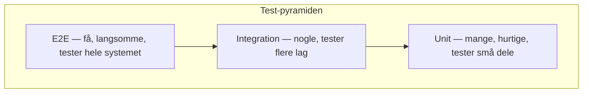
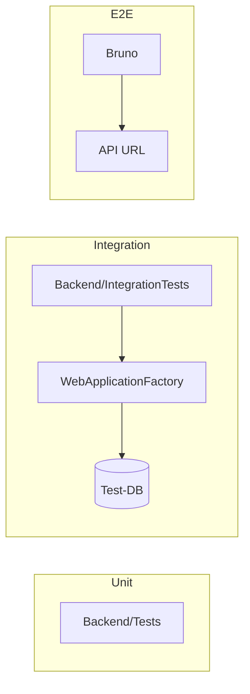

# Test-pyramiden

De tre testniveauer kan defineres ud fra to parametre: **hvor tæt du er på at teste som en reel bruger**, og **hvor mange tests du skal have** for at opnå god dækning.

## De tre niveauer

| Niveau | Hvad tester vi? | Hvor i h4-mags? |
|--------|-----------------|-----------------|
| **Unit** | Én klasse/metode i isolation (mocks) | `Backend/Tests/` — NUnit + Moq |
| **Integration** | Flere dele sammen (API + database) | `WebApplicationFactory` + test-DB |
| **E2E** | Hele brugerrejsen mod API (som en bruger) | `Bruno/E2E-UserFlows/` |

**Kort sagt:**

- Unit = *"Virker denne metode?"*
- Integration = *"Virker API + DB sammen?"*
- E2E = *"Kan en bruger registrere sig, logge ind og oprette en quiz?"*

## Test scopes

Diagrammet viser hvad hvert niveau dækker:

I vores test-setup kan integration og E2E hurtigt blande sig sammen. Med reelle 3.-parts-integrationer (fx Stripe) ville opdelingen være tydeligere.

### Unit tests

- Test individuelle metoder i isolation
- Test pure functions (`HashPassword`, `VerifyPassword`)
- Test model properties (User normalization)
- Test helper-metoder (`GeneratePin`, `MapToQuizDto`)
- Brug InMemory database eller mocks

### Integration tests

- Test API endpoints med rigtig database
- Test service + database sammen
- Test authentication flow

### E2E tests

- Test med Bruno (API testing)
- Test hele bruger flows
- Test Flutter app + API sammen

## Pyramiden i praksis

- **Nederst:** Mange unit tests — hurtige, isolerede
- **Midten:** Færre integration tests — tester at lag virker sammen
- **Øverst:** Få E2E-tests — tester hele rejsen, langsommere

I h4-mags har vi **unit** (`Backend/Tests`) og **E2E** (Bruno). E2E'erne bruges som smoke tests.

## Arkitektur i h4-mags

::: info Isolation er nøglen
Ved unit tests skal en fejl pege præcist på én metode. Du skal ikke gætte dig frem via dependencies — testen skal fortælle dig det præcist.
:::
