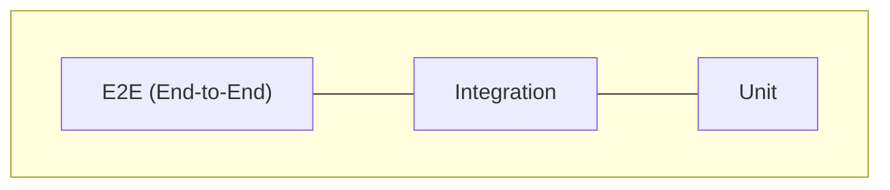

# Strategi og isolation

Unit tests dækker en enkelt metode helt isoleret — ofte på funktion eller klasse-niveau. Store kodebaser har derfor rigtig mange unit tests.

## Vores teststrategi

I vores test-setup kan integration og E2E hurtigt blande sig sammen. Med reelle 3.-parts-integrationer (fx Stripe) ville opdelingen være tydeligere.

## Hvad tester vi med unit tests?

- Individuelle metoder i isolation
- Pure functions (`HashPassword`, `VerifyPassword`)
- Model properties (User normalization)
- Helper-metoder (`GeneratePin`, `MapToQuizDto`)
- InMemory database eller mocks til dataadgang

## Isolation — hvorfor det betyder noget

Ved unit tests skal en fejl pege **præcist** på én metode. Du skal ikke se på dependencies og gætte dig frem.

| Princip | Betydning |
|---------|-----------|
| **Isolation** | Ingen afhængighed af SMTP, OAuth eller rigtig DB |
| **Hastighed** | Ingen netværk eller I/O → korte, stabile kørsler |
| **AAA** | Arrange mocks, act på metoden, assert resultat |
| **DI** | Interfaces som kontrakt — mocks i test, konkrete klasser i produktion |

## E2E i den anden ende

Med E2E tester vi oftest kun de centrale user flows — typisk 3.-parts-integrationer eller forretningskritiske funktioner. Her fokuserer vi ikke på fuld dækningsgrad, men på at sikre at de vigtigste brugerrejser fungerer fra ende til anden.

Det dækker et centralt behov: at koden virker som én samlet enhed med alle dependencies.

## Parametrene

De forskellige niveauer defineres ud fra:

1. **Hvor tæt på en reel bruger** — unit er langt væk, E2E er tæt på
2. **Antal tests for fuld dækning** — mange unit tests nederst, få E2E øverst

::: warning Unit ≠ integration
Hvis din test rammer en rigtig database eller sender HTTP-requests til API'et, er det **ikke** en unit test — se [Integration testing](/integration-testing/).
:::
